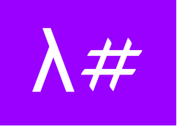

# 

# L# ( λSharp / LambdaSharp )
### A Language inspired from λ [Lambda Calculus](https://en.wikipedia.org/wiki/Lambda_calculus) written in F#

### Which transpiles to F# !


## Introduction

#### L# supports Pure Functional paradigm 

#### It provides `Function Abstractions` from `Lambda Calculus`

#### It is a `Turing Complete Language`


## Example

#### `L# Code`
```
( ^b. ( b( ^x. ^y. x ) ) ( ^x. ^y. y ) ) ( ^x. ^y. x )
```
       
#### `Transpiled to F#`
```f#
( fun b-> ( b( fun x-> fun y-> x ) ) ( fun x-> fun y-> y ) ) ( fun x-> fun y-> x )
```

#### `Bundler Code`
```f#
#load "../LambdaSharp.fsx"
open LambdaSharp      
LambdaSharp.transpileFromFile "./one.lsx" "one.target.fsx"
```

## License

### MIT
#### Copyright (c) 2018 Archan Patkar
